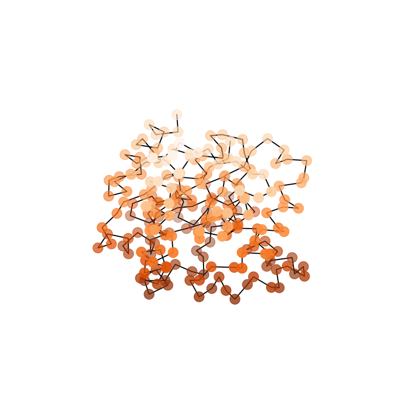
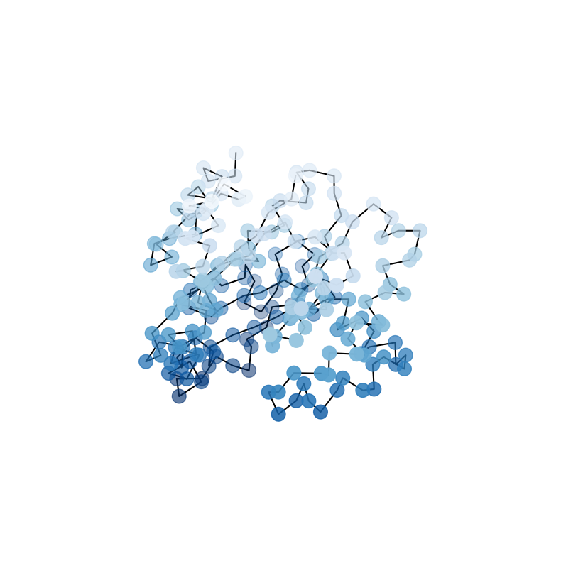
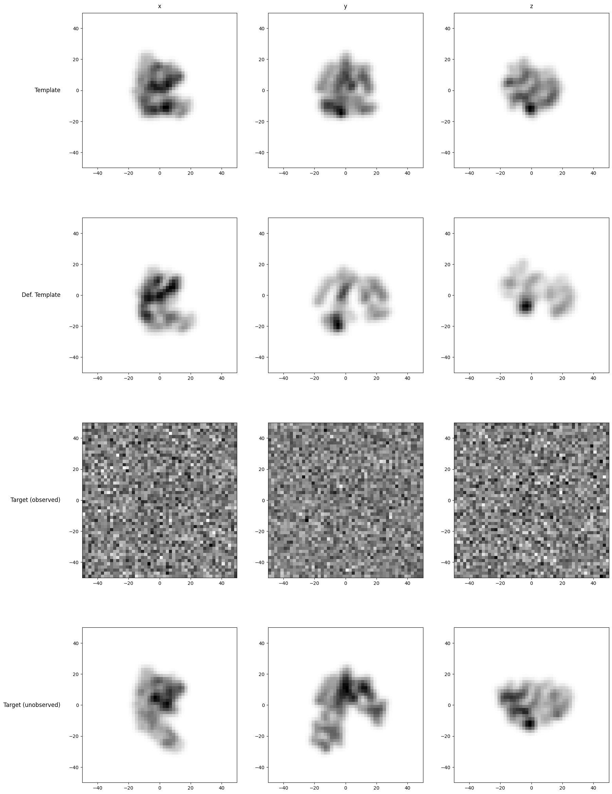
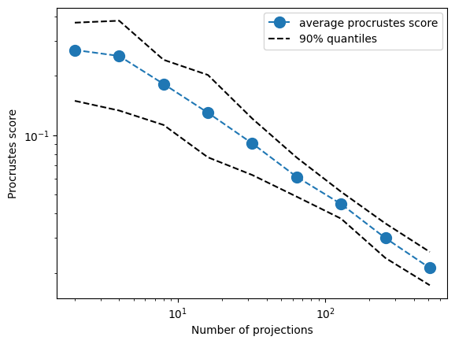
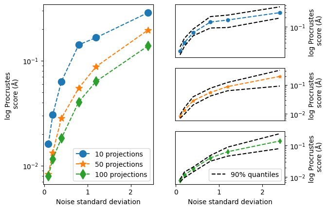

```python
import numpy as np
import matplotlib.pyplot as plt
import scipy.optimize as optim
import graphics

from grid import Grid
from data import Data
from forward import Forward
from optimize_list import Optimize_list

```
This notebook reproduces the paper experiments. 
First, we set up the experiment parameters. 
We choose an image resolution of 50x 50 pixels. 
The protein has a length of 214 $C-\alpha$ atoms. 
We choose a forward model Gaussian sd of 2.0 and a noise level of 1.0 

We discretize the protein path into 100 steps. Time step size is $h = 0.01$

We begin by using projections in the x, y and z directions. 


```python
np.random.seed(0)

# Grid params
res = 50
span = 50
# Protein params
N = 214#1000
blob_size= 2.0
noise_level = 1.0
# Opt params
h = 0.01


grid = Grid(res, span) #create grid
forward = Forward() #create forward model, use ONLY x, y, z for now

data = Data(N, grid,forward_model = forward, blob_size=blob_size, noise_sigma=noise_level) # create data 
optimize = Optimize_list(data,h) #create optimization problem 

SnRs = np.array([np.var(image)/noise_level**2 for image in data.target_projections_blur_nb])
average_SnR = np.mean(SnRs)
print(average_SnR)
print(SnRs)
print(10*np.log10(average_SnR))
print(10*np.log10(SnRs))
print(np.mean(10*np.log10(SnRs)))
```

    /Users/erikjans/miniforge3/lib/python3.10/site-packages/mdtraj/formats/pdb/pdbfile.py:200: UserWarning: Unlikely unit cell vectors detected in PDB file likely resulting from a dummy CRYST1 record. Discarding unit cell vectors.
      warnings.warn('Unlikely unit cell vectors detected in PDB file likely '


    0.003033389078958167
    [0.00321403 0.00251603 0.00337011]
    -25.180718811475373
    [-24.92950044 -25.99283866 -24.72356547]
    -25.21530152026963


As a preprocessing step for the later optimization algorithm, we determine a starting guess by running gradient descent for a few steps. We first initalize the variable 'u_full' as all zeros, and then run 50 gd steps with an lr of 1e-5. 


```python
u_full = np.zeros((100,N,3,3))
print(optimize.F(u_full))
for j in range(50):
    u_full = u_full- 0.0001*optimize.grad(u_full)
    if j%10 == 0: print(optimize.F(u_full))
```

    7328.832651220597
    7328.586383149592
    7326.527645371352
    7323.359179523939
    7321.606373434566
    7320.7739768423835


Now we put the forward model and its exact gradient into a scipy-readable format and run the L-BFGS-B algorithm. 


```python
def fg(vec):
    v = vec.reshape((100,N,3,3))
    f = optimize.F(v)
    g = optimize.grad(v)/N
    return (f,g.flatten())

def callback(x):
    print(f"Current solution: {x}")


out = optim.minimize(fg,u_full.flatten(),jac = True, method = 'L-BFGS-B', options = {'ftol': 1e-25,'gtol':1e-25},callback=callback)
print(out)
```

    Current solution: [ 0.00000000e+00  3.43118807e-02  7.95910829e-02 ...  8.33820748e-04
     -3.51832885e-04  2.10311240e-23]
    Current solution: [ 0.00000000e+00  7.98358863e-02  1.63202452e-01 ...  3.00307339e-03
     -1.75633242e-03  5.72057415e-23]
    Current solution: [ 0.00000000e+00  7.88767028e-02  1.60851374e-01 ...  3.18970455e-03
     -1.93898177e-03  6.45920994e-23]
    Current solution: [ 0.00000000e+00  6.26728829e-02  1.26834294e-01 ...  3.36171301e-03
     -2.24167080e-03 -4.95884686e-23]
    Current solution: [ 0.00000000e+00  6.26728829e-02  1.26834294e-01 ...  3.36171301e-03
     -2.24167080e-03 -4.95884686e-23]
          fun: 7313.897786960968
     hess_inv: <192600x192600 LbfgsInvHessProduct with dtype=float64>
          jac: array([ 0.00000000e+00, -3.08510517e-03, -1.92156718e-02, ...,
           -2.62156793e-05,  4.45183983e-04, -3.79977397e-22])
      message: 'CONVERGENCE: REL_REDUCTION_OF_F_<=_FACTR*EPSMCH'
         nfev: 49
          nit: 5
         njev: 49
       status: 0
      success: True
            x: array([ 0.00000000e+00,  6.26728829e-02,  1.26834294e-01, ...,
            3.36171301e-03, -2.24167080e-03, -4.95884686e-23])


Now extract the found algebra path and deform the template. Plot the target, template and deformed template. 


```python
u_full = out.x.reshape((100,N,3,3))
R_full = optimize.euler(u_full)


R1 = R_full[-1]
template_model = data.template_model
def_model = forward.act(R1, template_model)
def_model_pc = forward.M(def_model)

da = forward.M(def_model)
da1 = forward.M(data.template_model)
da2 = data.target_pc


```


```python
graphics.spaceplot(da1,'Oranges_r', save = True, filename = 'template.pdf',dpi = 150)

graphics.spaceplot(da,'Blues_r', save = True, filename = 'deformed_3d.pdf',dpi = 150)

graphics.spaceplot(da2,'Greens_r', save = True, filename = 'target.pdf',dpi = 150)
```


    (<Figure size 1000x1000 with 1 Axes>, <Axes3DSubplot:>)


    

    


    

    


    

    


It does not look too good! But let's look at the projection images of the deformed proteins. 


```python
def_x = forward.blur(forward.project(da,forward.projections[0]), grid, blob_size)
def_y = forward.blur(forward.project(da,forward.projections[1]), grid, blob_size)
def_z = forward.blur(forward.project(da,forward.projections[2]), grid, blob_size)

template_x = data.template_projections_blur[0]
template_y = data.template_projections_blur[1]
template_z = data.template_projections_blur[2]

target_noblur_x = data.target_projections_blur_nb[0]
target_noblur_y = data.target_projections_blur_nb[1]
target_noblur_z = data.target_projections_blur_nb[2]


target_x = data.target_projections_blur[0]
target_y = data.target_projections_blur[1]
target_z = data.target_projections_blur[2]

shape = (4,3)
rows = ['Template','Def. Template','Target (observed)', 'Target (unobserved)']
cols = ['x','y','z']

image_dict = {(0,0): template_x,
             (0,1): template_y,
             (0,2): template_z,
             (1,0): def_x,
             (1,1): def_y,
             (1,2): def_z,
             (2,0): target_x,
             (2,1): target_y,
             (2,2): target_z,
             (3,0): target_noblur_x,
             (3,1): target_noblur_y,
             (3,2): target_noblur_z}
fig,ax = graphics.imagegridplot(image_dict,shape,span, colnames = cols, rownames =rows,save = True, filename = '3dres.pdf',dpi = 150)
```


    

    


What do we conclude from these plots? That we manage a decent recostrunctions in the directions we project. We are therefore going to repeat the process with more projection images. 


```python
from scipy.spatial import procrustes 

# Grid params
res = 50
span = 50
# Protein params
N = 214#1000
blob_size= 2.0
noise_level = 1.0
# Opt params
h = 0.01

No_projections = 300

grid = Grid(res, span) #create grid
np.random.seed(123)
forward = Forward(No_projections) #create forward model, use ONLY x, y, z for now

np.random.seed(0)
data = Data(N, grid,forward_model = forward, blob_size=blob_size, noise_sigma=noise_level) # create data 

optimize = Optimize_list(data,h) #create optimization problem 

u_full = np.zeros((100,N,3,3))

for j in range(50):
    u_full = u_full- 0.0001*optimize.grad(u_full)
    
out = optim.minimize(fg,u_full.flatten(),jac = True, method = 'L-BFGS-B', options = {'ftol': 1e-25,'gtol':1e-25},callback=callback)
u_full = out.x.reshape((100,N,3,3))
R_full = optimize.euler(u_full)


R1 = R_full[-1]
template_model = data.template_model
def_model = forward.act(R1, template_model)
def_model_pc = forward.M(def_model)

da = forward.M(def_model)
da1 = forward.M(data.template_model)
da2 = data.target_pc

graphics.spaceplot(da1,'Oranges_r')

graphics.spaceplot(da,'Blues_r', save = True, filename = 'deformed_300images.pdf',dpi = 150)

graphics.spaceplot(da2,'Greens_r')

```

    /Users/erikjans/miniforge3/lib/python3.10/site-packages/mdtraj/formats/pdb/pdbfile.py:200: UserWarning: Unlikely unit cell vectors detected in PDB file likely resulting from a dummy CRYST1 record. Discarding unit cell vectors.
      warnings.warn('Unlikely unit cell vectors detected in PDB file likely '


    Current solution: [ 0.00000000e+00 -1.08410361e-02 -1.70600373e-02 ... -9.66639760e-03
     -9.56172427e-04  1.11553107e-22]
    Current solution: [ 0.00000000e+00  1.55523317e-03  3.60322230e-02 ... -9.91808861e-03
     -9.91380886e-04 -2.54191141e-23]
    Current solution: [ 0.00000000e+00  2.80158317e-03  3.00704609e-02 ... -1.00161193e-02
     -9.59608973e-04 -6.76299123e-23]
    Current solution: [ 0.00000000e+00  2.75097634e-03  2.64101946e-02 ... -1.01762260e-02
     -9.74336955e-04 -1.08467984e-22]
    Current solution: [ 0.00000000e+00 -4.73499251e-03  4.08960061e-03 ... -1.03322386e-02
     -1.00629991e-03 -1.40533537e-22]
    Current solution: [ 0.00000000e+00 -5.98977939e-03 -3.79112859e-03 ... -1.05540121e-02
     -9.46486147e-04 -4.51297178e-23]
    Current solution: [ 0.00000000e+00 -7.20075887e-03 -7.33448870e-03 ... -1.07920412e-02
     -8.53451220e-04 -6.17948697e-23]
    Current solution: [ 0.00000000e+00 -1.02243551e-02 -1.53300941e-02 ... -1.25416735e-02
     -2.04559880e-04 -3.68351464e-22]
    Current solution: [ 0.00000000e+00 -6.45754284e-03 -4.08814981e-03 ... -1.34520770e-02
      1.98828080e-04 -3.23539102e-22]
    Current solution: [ 0.00000000e+00 -4.50243386e-03  7.74345976e-03 ... -1.42632418e-02
      4.97426032e-04 -3.24610550e-22]
    Current solution: [ 0.00000000e+00 -3.01937020e-03  1.25284720e-02 ... -1.42439183e-02
      4.42879831e-04 -3.90045286e-22]
    Current solution: [ 0.00000000e+00 -3.16301473e-03  1.40326382e-02 ... -1.42615812e-02
      3.25871770e-04 -4.11909137e-22]
    Current solution: [ 0.00000000e+00 -5.81574541e-03  1.14545085e-02 ... -1.42946271e-02
      2.26944379e-05 -5.78962402e-22]
    Current solution: [ 0.00000000e+00 -6.38220766e-03  1.02334406e-02 ... -1.44641080e-02
     -3.37146733e-04 -2.03230033e-21]
    Current solution: [ 0.00000000e+00 -6.91201254e-03  1.07381790e-02 ... -1.45176767e-02
     -8.09800325e-04 -3.89670160e-21]
    Current solution: [ 0.00000000e+00 -7.11538723e-03  1.07856627e-02 ... -1.42893420e-02
     -1.13787997e-03 -5.22346202e-21]
    Current solution: [ 0.00000000e+00 -5.97537084e-03  1.34775306e-02 ... -1.41161491e-02
     -1.44800286e-03 -6.49204881e-21]
    Current solution: [ 0.00000000e+00 -5.33474668e-03  1.61228025e-02 ... -1.38124574e-02
     -1.98527344e-03 -7.91471769e-21]
    Current solution: [ 0.00000000e+00 -4.31932089e-03  1.65354190e-02 ... -1.37190078e-02
     -2.26758210e-03 -8.89857926e-21]
    Current solution: [ 0.00000000e+00 -4.39371190e-03  1.69028922e-02 ... -1.38195417e-02
     -2.34822395e-03 -9.14625637e-21]
    Current solution: [ 0.00000000e+00 -4.45062511e-03  1.54088455e-02 ... -1.38719636e-02
     -2.50242030e-03 -9.61754919e-21]
    Current solution: [ 0.00000000e+00 -4.37233346e-03  1.23334688e-02 ... -1.39633493e-02
     -2.70422201e-03 -1.04569689e-20]
    Current solution: [ 0.00000000e+00 -2.71730314e-03  9.44573916e-03 ... -1.40871971e-02
     -3.38702954e-03 -1.20866578e-20]
    Current solution: [ 0.00000000e+00 -4.34969199e-03  9.30438356e-04 ... -1.41316264e-02
     -3.78646948e-03 -1.38801360e-20]
    Current solution: [ 0.00000000e+00 -5.41220847e-03 -4.58954106e-03 ... -1.44507714e-02
     -4.04381552e-03 -1.48786930e-20]
    Current solution: [ 0.00000000e+00 -4.95434538e-03 -4.71911871e-03 ... -1.45162554e-02
     -4.09516544e-03 -1.51589659e-20]
    Current solution: [ 0.00000000e+00 -3.18963160e-03 -1.56274451e-05 ... -1.46125502e-02
     -4.13743332e-03 -1.54841823e-20]
    Current solution: [ 0.00000000e+00 -1.63521631e-03  3.66714528e-03 ... -1.47067180e-02
     -4.39739199e-03 -1.65612484e-20]
    Current solution: [ 0.00000000e+00  4.39005203e-04  9.13898553e-03 ... -1.48505322e-02
     -4.59369930e-03 -1.75424878e-20]
    Current solution: [ 0.00000000e+00  6.72232823e-03  2.79690210e-02 ... -1.56609483e-02
     -5.06233054e-03 -1.94897037e-20]
    Current solution: [ 0.00000000e+00  1.01008850e-02  3.38562178e-02 ... -1.62545456e-02
     -5.37434302e-03 -2.11693949e-20]
    Current solution: [ 0.00000000e+00  8.73858632e-03  3.15237423e-02 ... -1.64683584e-02
     -5.12462246e-03 -2.05126317e-20]
    Current solution: [ 0.00000000e+00  8.73171469e-03  3.32701177e-02 ... -1.69404160e-02
     -4.80851680e-03 -1.98235180e-20]
    Current solution: [ 0.00000000e+00  9.85325838e-03  3.67278008e-02 ... -1.76723441e-02
     -4.39472699e-03 -1.96596393e-20]
    Current solution: [ 0.00000000e+00  1.49572627e-02  4.99825505e-02 ... -1.87599660e-02
     -3.79222809e-03 -1.95950929e-20]
    Current solution: [ 0.00000000e+00  2.52252436e-02  7.17736637e-02 ... -2.05181100e-02
     -3.35723232e-03 -2.10699980e-20]
    Current solution: [ 0.00000000e+00  3.22924264e-02  8.84271809e-02 ... -2.14380636e-02
     -3.37605284e-03 -2.35196695e-20]
    Current solution: [ 0.00000000e+00  3.25227683e-02  8.86771223e-02 ... -2.14405617e-02
     -3.41483074e-03 -2.37501870e-20]
    Current solution: [ 0.00000000e+00  3.25878317e-02  8.87560337e-02 ... -2.14377637e-02
     -3.43182673e-03 -2.38706985e-20]
    Current solution: [ 0.00000000e+00  3.28153985e-02  8.89458401e-02 ... -2.14469615e-02
     -3.50124255e-03 -2.44229691e-20]
    Current solution: [ 0.00000000e+00  3.33192330e-02  9.02687620e-02 ... -2.15437548e-02
     -3.47580899e-03 -2.49245620e-20]
    Current solution: [ 0.00000000e+00  3.28050404e-02  9.05249747e-02 ... -2.15958444e-02
     -3.35486732e-03 -2.45202559e-20]
    Current solution: [ 0.00000000e+00  3.20023953e-02  8.96515125e-02 ... -2.15310117e-02
     -3.19238009e-03 -2.40506665e-20]
    Current solution: [ 0.00000000e+00  3.05571207e-02  8.84148036e-02 ... -2.16697573e-02
     -2.76824464e-03 -2.29758866e-20]
    Current solution: [ 0.00000000e+00  2.88567502e-02  8.69519734e-02 ... -2.21329494e-02
     -1.99588755e-03 -2.06820746e-20]
    Current solution: [ 0.00000000e+00  2.74168135e-02  8.43295955e-02 ... -2.21884107e-02
     -1.53341109e-03 -1.84473310e-20]
    Current solution: [ 0.00000000e+00  2.71679939e-02  8.30779180e-02 ... -2.21704342e-02
     -1.53004714e-03 -1.81645240e-20]
    Current solution: [ 0.00000000e+00  2.63623820e-02  8.11533796e-02 ... -2.21890013e-02
     -1.34424374e-03 -1.73716285e-20]
    Current solution: [ 0.00000000e+00  2.53926051e-02  7.89271937e-02 ... -2.22047455e-02
     -1.15897323e-03 -1.68554164e-20]
    Current solution: [ 0.00000000e+00  2.09303114e-02  6.90826827e-02 ... -2.23533191e-02
     -3.23774127e-04 -1.40243435e-20]
    Current solution: [ 0.00000000e+00  1.78105626e-02  6.30123421e-02 ... -2.26351240e-02
      5.53180659e-04 -1.14360532e-20]
    Current solution: [ 0.00000000e+00  1.80393896e-02  6.33582665e-02 ... -2.28427416e-02
      9.56227229e-04 -1.02209631e-20]
    Current solution: [ 0.00000000e+00  2.04490801e-02  6.89054627e-02 ... -2.34887126e-02
      2.03162511e-03 -7.30992688e-21]
    Current solution: [ 0.00000000e+00  2.36533988e-02  7.59470792e-02 ... -2.40304109e-02
      2.85663825e-03 -5.60541927e-21]
    Current solution: [ 0.00000000e+00  2.80466758e-02  8.74626855e-02 ... -2.54214504e-02
      5.41092127e-03  2.60255927e-21]
    Current solution: [ 0.00000000e+00  2.85055638e-02  8.79165236e-02 ... -2.54668431e-02
      5.62513036e-03  3.41111226e-21]
    Current solution: [ 0.00000000e+00  2.85205403e-02  8.84195384e-02 ... -2.54703064e-02
      5.69722109e-03  4.22281772e-21]
    Current solution: [ 0.00000000e+00  3.00770640e-02  9.48428017e-02 ... -2.61216663e-02
      7.33091004e-03  1.13542530e-20]
    Current solution: [ 0.00000000e+00  3.00663712e-02  9.63155293e-02 ... -2.60160950e-02
      7.34776580e-03  1.17317634e-20]
    Current solution: [ 0.00000000e+00  2.96838495e-02  9.62668299e-02 ... -2.60301431e-02
      7.57943454e-03  1.26603760e-20]
    Current solution: [ 0.00000000e+00  3.02836181e-02  9.87108243e-02 ... -2.61301036e-02
      8.20578011e-03  1.53902850e-20]
    Current solution: [ 0.00000000e+00  3.48440628e-02  1.11418553e-01 ... -2.64941354e-02
      1.02562110e-02  2.29108057e-20]
    Current solution: [ 0.00000000e+00  3.42167789e-02  1.10685779e-01 ... -2.64108455e-02
      1.11734066e-02  2.70890797e-20]
    Current solution: [ 0.00000000e+00  3.38840248e-02  1.08745554e-01 ... -2.63409409e-02
      1.08551449e-02  2.55600028e-20]
    Current solution: [ 0.00000000e+00  3.37961334e-02  1.07124529e-01 ... -2.61799820e-02
      1.08552587e-02  2.53473829e-20]
    Current solution: [ 0.00000000e+00  3.32924991e-02  1.06050994e-01 ... -2.61677508e-02
      1.14776911e-02  2.75790305e-20]
    Current solution: [ 0.00000000e+00  3.16073132e-02  1.02960419e-01 ... -2.61138205e-02
      1.40103032e-02  3.59723285e-20]
    Current solution: [ 0.00000000e+00  3.08632484e-02  1.00886304e-01 ... -2.59097681e-02
      1.52393623e-02  3.92849989e-20]
    Current solution: [ 0.00000000e+00  2.85602118e-02  9.49695206e-02 ... -2.57195244e-02
      1.52872199e-02  3.83832193e-20]
    Current solution: [ 0.00000000e+00  2.57838309e-02  8.82941327e-02 ... -2.54655293e-02
      1.66687257e-02  4.09614608e-20]
    Current solution: [ 0.00000000e+00  2.59645491e-02  8.83486164e-02 ... -2.53411667e-02
      1.70406101e-02  4.11968645e-20]
    Current solution: [ 0.00000000e+00  2.62636241e-02  8.90356942e-02 ... -2.53447849e-02
      1.71671482e-02  4.15056878e-20]
    Current solution: [ 0.00000000e+00  2.67613940e-02  9.01107641e-02 ... -2.53490442e-02
      1.74323699e-02  4.14379205e-20]
    Current solution: [ 0.00000000e+00  2.90688613e-02  9.52040503e-02 ... -2.54427896e-02
      1.82199571e-02  3.99948535e-20]
    Current solution: [ 0.00000000e+00  3.05999527e-02  9.82277882e-02 ... -2.54883731e-02
      2.00282341e-02  4.29423216e-20]
    Current solution: [ 0.00000000e+00  3.16059443e-02  1.00131359e-01 ... -2.54865072e-02
      2.14101959e-02  4.64369441e-20]
    Current solution: [ 0.00000000e+00  3.16314758e-02  9.97959369e-02 ... -2.54623195e-02
      2.29734616e-02  5.12501929e-20]
    Current solution: [ 0.00000000e+00  3.10675666e-02  9.82758190e-02 ... -2.53337104e-02
      2.66271104e-02  6.28938346e-20]
    Current solution: [ 0.00000000e+00  3.20610233e-02  1.01830488e-01 ... -2.54459684e-02
      2.73616840e-02  6.51488303e-20]
    Current solution: [ 0.00000000e+00  3.11741514e-02  1.00984393e-01 ... -2.53954951e-02
      2.76828850e-02  6.69682020e-20]
    Current solution: [ 0.00000000e+00  3.01079889e-02  9.91142293e-02 ... -2.52075703e-02
      2.91697562e-02  7.04700547e-20]
    Current solution: [ 0.00000000e+00  3.07853691e-02  1.00731996e-01 ... -2.52043167e-02
      3.05578983e-02  7.15592058e-20]
    Current solution: [ 0.00000000e+00  3.01730860e-02  9.91575177e-02 ... -2.50622328e-02
      3.13901886e-02  7.11508107e-20]
    Current solution: [ 0.00000000e+00  2.94764896e-02  9.72856681e-02 ... -2.48071666e-02
      3.27866059e-02  6.86083484e-20]
    Current solution: [ 0.00000000e+00  3.00066155e-02  9.77294980e-02 ... -2.47184601e-02
      3.44478956e-02  6.84568081e-20]
    Current solution: [ 0.00000000e+00  3.23847882e-02  1.01508364e-01 ... -2.47092557e-02
      3.71507340e-02  6.60692397e-20]
    Current solution: [ 0.00000000e+00  3.37247007e-02  1.04081795e-01 ... -2.47158532e-02
      3.82076778e-02  6.26990386e-20]
    Current solution: [ 0.00000000e+00  3.59627641e-02  1.09077320e-01 ... -2.48078295e-02
      4.01994392e-02  6.05323270e-20]
    Current solution: [ 0.00000000e+00  3.64361238e-02  1.10027975e-01 ... -2.47951674e-02
      4.24042966e-02  5.28170020e-20]
    Current solution: [ 0.00000000e+00  3.65711814e-02  1.10301794e-01 ... -2.47940534e-02
      4.25432712e-02  5.23408553e-20]
    Current solution: [ 0.00000000e+00  3.65509449e-02  1.10254256e-01 ... -2.47995605e-02
      4.27612290e-02  5.00423802e-20]
    Current solution: [ 0.00000000e+00  3.68478376e-02  1.10931894e-01 ... -2.48128246e-02
      4.34749742e-02  4.92073045e-20]
    Current solution: [ 0.00000000e+00  3.84862137e-02  1.14514280e-01 ... -2.48951963e-02
      4.70153413e-02  4.42628806e-20]
    Current solution: [ 0.00000000e+00  3.98010212e-02  1.17411141e-01 ... -2.50372116e-02
      4.90235235e-02  4.27234335e-20]
    Current solution: [ 0.00000000e+00  4.27357462e-02  1.24384162e-01 ... -2.55499747e-02
      5.42154955e-02  3.53797741e-20]
    Current solution: [ 0.00000000e+00  4.38462105e-02  1.26107147e-01 ... -2.56302708e-02
      5.52219849e-02  3.20724181e-20]
    Current solution: [ 0.00000000e+00  4.39976611e-02  1.26064308e-01 ... -2.57155723e-02
      5.52588115e-02  2.95083241e-20]
    Current solution: [ 0.00000000e+00  4.39976611e-02  1.26064308e-01 ... -2.57155723e-02
      5.52588115e-02  2.95083241e-20]


    (<Figure size 1000x1000 with 1 Axes>, <Axes3DSubplot:>)


    

    


    

    


    

    


```python
from scipy.spatial import procrustes 


M = 20
L = 10
scores = np.zeros((L,M))
for i in range(L):
    No_projections = int(2**i)
    print("running for:"+ str(2**i)+" projection images")
    for m in range(M):
        np.random.seed(0)
        forward = Forward(No_projections) 

        np.random.seed(i*1000+m*100*i)
        data = Data(N, grid,forward_model = forward, blob_size=blob_size, noise_sigma=noise_level) # create data 
    
        optimize = Optimize_list(data,h) #create optimization problem 

        u_full = np.zeros((100,N,3,3))

        for j in range(50):
            u_full = u_full- 0.00001*optimize.grad(u_full)

        out = optim.minimize(fg,u_full.flatten(),jac = True, method = 'L-BFGS-B', options = {'ftol': 1e-25,'gtol':1e-25})

        u_full = out.x.reshape((100,N,3,3))
        R_full = optimize.euler(u_full)


        R1 = R_full[-1]
        template_model = data.template_model
        def_model = forward.act(R1, template_model)
        def_model_pc = forward.M(def_model)

        da = forward.M(def_model)
        scores[i,m] = procrustes(da2,da)[-1]
average_scores = np.sum(scores,axis = 1)/M
    
    
    


```

    running for:1 projection images
    running for:2 projection images
    running for:4 projection images
    running for:8 projection images
    running for:16 projection images
    running for:32 projection images
    running for:64 projection images
    running for:128 projection images
    running for:256 projection images
    running for:512 projection images


```python
plt.loglog([2,4,8,16,32,64,128,256,512],average_scores[1:],'--o', markersize = 10, label='average procrustes score')
plt.loglog([2,4,8,16,32,64,128,256,512], np.quantile(scores,0.90,axis = 1)[1:],'--', markersize = 10,c = 'k', label='90% quantiles')
plt.loglog([2,4,8,16,32,64,128,256,512], np.quantile(scores,0.10,axis = 1)[1:],'--', markersize = 10,c = 'k')
plt.legend()
plt.ylabel('Procrustes score')
plt.xlabel('Number of projections')
#plt.savefig('proc_plot.pdf',dpi = 150)
```


    

    


```python
#slope estimation
from scipy.stats import linregress
print(linregress(np.log([4,8,16,32,64,128,256,512]),np.log(average_scores[2:] ))[0]) #without first point

print(linregress(np.log([2,4,8,16,32,64,128,256,512]),np.log(average_scores[1:] ))[0]) #with first point
```

    -0.5140856167810125
    -0.48390201110103165


```python

M = 20
L = 6
projections_vector = [10,50,100]
noise_levels = [0.1,0.2,0.4,0.8,1.2,2.4]
scores_noise_test = np.zeros((3,L,M))
for i in range(3):
    No_projections = projections_vector[i]
    for k in range(L):
        noise_level = noise_levels[k]
        print("running for:"+ str(No_projections)+" projection images, with noise level:"+str(noise_level))    
        for m in range(M):
            np.random.seed(0)
            forward = Forward(No_projections) 

            np.random.seed(i*1000+m*100*i+m*(0.5*i**2-3/2*i + 1))
            data = Data(N, grid,forward_model = forward, blob_size=blob_size, noise_sigma=noise_level) # create data 
    
            optimize = Optimize_list(data,h) #create optimization problem 

            u_full = np.zeros((100,N,3,3))

            for j in range(50):
                u_full = u_full- 0.00001*optimize.grad(u_full)

            out = optim.minimize(fg,u_full.flatten(),jac = True, method = 'L-BFGS-B', options = {'ftol': 1e-25,'gtol':1e-25})

            u_full = out.x.reshape((100,N,3,3))
            R_full = optimize.euler(u_full)


            R1 = R_full[-1]
            template_model = data.template_model
            def_model = forward.act(R1, template_model)
            def_model_pc = forward.M(def_model)

            da = forward.M(def_model)
            scores_noise_test[i,k,m] = procrustes(da2,da)[-1]

        


```

    running for:10 projection images, with noise level:0.1
    running for:10 projection images, with noise level:0.2
    running for:10 projection images, with noise level:0.4
    running for:10 projection images, with noise level:0.8
    running for:10 projection images, with noise level:1.2
    running for:10 projection images, with noise level:2.4
    running for:50 projection images, with noise level:0.1
    running for:50 projection images, with noise level:0.2
    running for:50 projection images, with noise level:0.4
    running for:50 projection images, with noise level:0.8
    running for:50 projection images, with noise level:1.2
    running for:50 projection images, with noise level:2.4
    running for:100 projection images, with noise level:0.1
    running for:100 projection images, with noise level:0.2
    running for:100 projection images, with noise level:0.4
    running for:100 projection images, with noise level:0.8
    running for:100 projection images, with noise level:1.2
    running for:100 projection images, with noise level:2.4


```python
from matplotlib.gridspec import GridSpec
import matplotlib.pyplot as plt

fig=plt.figure()

gs=GridSpec(3,2) # 2 rows, 3 columns

ax1=fig.add_subplot(gs[:,0]) # First row, first column
ax2=fig.add_subplot(gs[0,1]) # First row, second column
ax3=fig.add_subplot(gs[1,1]) # First row, third column
ax4=fig.add_subplot(gs[2,1])


ax2.semilogy([0.1,0.2,0.4,0.8,1.2,2.4],np.mean(scores_noise_test[0,:,:],axis = 1),'--o', markersize = 5, label='10 projections')
ax2.semilogy([0.1,0.2,0.4,0.8,1.2,2.4], np.quantile(scores_noise_test[0,:,:],0.90,axis = 1),'--', markersize = 5,c = 'k', label='90% quantiles')
ax2.semilogy([0.1,0.2,0.4,0.8,1.2,2.4], np.quantile(scores_noise_test[0,:,:],0.10,axis = 1),'--', markersize = 5,c = 'k')

ax2.get_xaxis().set_visible(False)
ax2.yaxis.tick_right()
ax2.set_ylabel('log Procrustes \n score (Å)')
ax2.yaxis.set_label_position("right")

ax3.semilogy([0.1,0.2,0.4,0.8,1.2,2.4],np.mean(scores_noise_test[1,:,:],axis = 1),'--*', markersize = 5,c = 'tab:orange', label='50 projections')
ax3.semilogy([0.1,0.2,0.4,0.8,1.2,2.4], np.quantile(scores_noise_test[1,:,:],0.90,axis = 1),'--', markersize = 5,c = 'k', label='90% quantiles')
ax3.semilogy([0.1,0.2,0.4,0.8,1.2,2.4], np.quantile(scores_noise_test[1,:,:],0.10,axis = 1),'--', markersize = 5,c = 'k')
ax3.yaxis.tick_right()
ax3.set_ylabel('log Procrustes \n  score (Å)')
ax3.yaxis.set_label_position("right")
ax3.get_xaxis().set_visible(False)

ax4.semilogy([0.1,0.2,0.4,0.8,1.2,2.4],np.mean(scores_noise_test[2,:,:],axis = 1),'--d', markersize = 5,c = 'tab:green')
ax4.semilogy([0.1,0.2,0.4,0.8,1.2,2.4], np.quantile(scores_noise_test[2,:,:],0.90,axis = 1),'--', markersize = 5,c = 'k', label='90% quantiles')
ax4.semilogy([0.1,0.2,0.4,0.8,1.2,2.4], np.quantile(scores_noise_test[2,:,:],0.10,axis = 1),'--', markersize = 5,c = 'k')
ax4.yaxis.tick_right()
ax4.legend()
ax4.set_ylabel('log Procrustes \n score (Å)')
ax4.yaxis.set_label_position("right")
ax4.set_xlabel('Noise standard deviation')


ax1.semilogy([0.1,0.2,0.4,0.8,1.2,2.4],np.mean(scores_noise_test[0,:,:],axis = 1),'--o', markersize = 10, label='10 projections')
ax1.semilogy([0.1,0.2,0.4,0.8,1.2,2.4], np.mean(scores_noise_test[1,:,:],axis = 1),'--*', markersize = 10, label='50 projections')
ax1.semilogy([0.1,0.2,0.4,0.8,1.2,2.4], np.mean(scores_noise_test[2,:,:],axis = 1),'--d', markersize = 10,label = '100 projections')

ax1.legend()
ax1.set_ylabel('log Procrustes \n score (Å)')
ax1.set_xlabel('Noise standard deviation')
#plt.savefig('proc_plot_noise.pdf',dpi = 150)

```


    

    


```python
scores = np.loadtxt('scores.txt')
M = 20
scores_noise_test = np.loadtxt('scores_noise_test.txt').reshape((3,6,20))
```


```python

```
